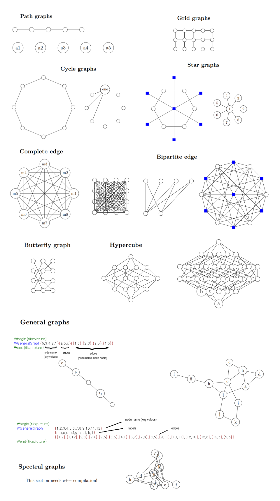

# Graph Drawing LaTeX Package

### Package component
The package is written in Lua, it must be compiled with LuaLaTeX.  
It is also written on top of PGF-TikZ, make sure to add it as dependency.
+ graphdrawingpackage.sty
+ spectralcppcode.cpp

### Sample image

### Instructions
+ Manual.pdf: Instruction for environment set up of package and how to use.
+ demo.tex & demo.pdf: Example usage of package and its compiled result.